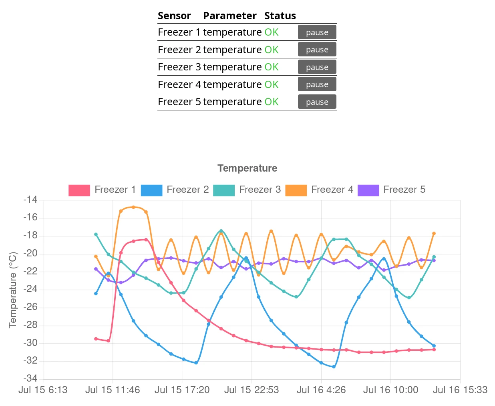

# SensorAlarmChart

* Listens *passively* (ie. no pairing) to Bluetooth Low Energy (BLE) sensors
* Sends user-defined alarms on Slack or Matrix. For example, when temperature is tow low or too high.
* Beautiful live graphs tracking sensors over time

SensorAlarmChart on Raspberry Pi


SensorAlarmChart web interface



## Hardware parts

* *Sensor(s)*. Inkbird Temperature and humidity Hygrometer [IBS-TH2](https://inkbird.com/products/hygrometer-ibs-th2) is recommended. See [BLE parser](https://github.com/Ernst79/bleparser) for list of supported sensors. Inside freezers, [lithium batteries](https://www.energizer.com/batteries/energizer-ultimate-lithium-batteries) are recommended.
* [Raspberry Pi 4](https://www.raspberrypi.com/products/raspberry-pi-4-model-b) and SD card
* *Optional*. [Waveshare 4.3inch DSI LCD](https://www.waveshare.com/wiki/4.3inch_DSI_LCD)

## Software architecture

SensorAlarmChart is an asynchronous Python script. The asyncio-based Python library [aioblescan](https://github.com/frawau/aioblescan) is used to listen for passive BLE advertised packets, which are parsed using [BLE parser](https://github.com/Ernst79/bleparser). Sensor(s) status is served on HTTP (on 8080 by default) using [aiohttp](https://docs.aiohttp.org/en/stable). Charts in the web app are plotted using [Chart.js](https://www.chartjs.org).

## Install

1. Install [Raspberry Pi OS (64-bit)](https://www.raspberrypi.com/software/operating-systems) on SD card
2. Using `raspi-config`, configure:
    * Locale & Time
    * Activate sshd
3. Enable SSH:
    ```
    systemctl enable ssh
    ```
4. Set the root password:
    ```
    sudo passwd
    ```
5. Add the `tech` user:
    ```
    useradd -m tech
    passwd tech
    ```
6. Lock the default `pi` account:
    ```
    usermod -L pi
    ```
7. Upgrade Debian system
    ```
    apt-get update
    apt-get upgrade
    ```
7. Install SensorAlarmChart Python dependencies provided by Debian
    ```
    apt-get install python3-pip
    apt-get install python3-aiohttp
    ```
8. **As user tech**, install SensorAlarmChart Python dependencies:
    ```
    pip3 install aioblescan --user
    pip3 install bleparser --user
    pip3 install tomli --user
    ```
9. Finally, **as user tech**, copy the SensorAlarmChart `sensor_app` directory in `/home/tech`.

## Configuration

SensorAlarmChart configuration is defined in `sensor_app/config.toml`. Example is provided in `sensor_app/example_config.toml`.

* `hci_device`. To get a a list of Bluetooth controller: `bluetoothctl list`
* `[[sensors]]`. When adding a new sensor, list the BLE devices in range using `bluetoothctl scan on`. Alarms are set for each sensor. `history_seconds` defines how frequently records should be saved and `history_records` how many records. Same for `supp_history_seconds` and `supp_history_records` respectively.
* `[[reporters]]`. See below.

### Console reporter

This reporter displays a table listing all sensors on the main text console.

### Matrix reporter

1. Get the access token from the *Help & About* tab in the user config (details in this [post](https://webapps.stackexchange.com/questions/131056/how-to-get-an-access-token-for-riot-matrix)). Input this token in the `TOKEN` parameter of the Matrix reporter.
2. Get the *Internal room ID* from the *Advanced* tab in the config page from the room where messages should be sent. Input this room ID in the `ROOM` parameter of the Matrix reporter.

### Slack reporter

1. Create a [Webhook](https://api.slack.com/messaging/webhooks).
2. Input the `TOKENxxx/Bxxx/Gxxx` in `url` parameter of the Slack reporter.

### Systemd

To start SensorAlarmChart automatically at boot, copy the systemd service file `systemd/sensor_alarm_chart.service` in `/etc/systemd/system`. Then enable the service using:
```
systemctl enable sensor_alarm_chart.service
```

## Report

If the `host` entry in the config file is left empty and port is set at `8080`, the app will serve:
* A JSON report at http://[first_IP]:8080/status
* A report based on [Chart.js](https://www.chartjs.org) at http://[first_IP]:8080

### Nginx

*This step is entirely optional.* The SensorAlarmChart http service can be reverse-proxied using [Nginx](https://nginx.org):

```
location /freezers/ {
    proxy_set_header         X-Forwarded-Proto $scheme;
    proxy_set_header         X-Forwarded-Host $host;
    proxy_set_header         X-Request-Redirect $request_uri;

    proxy_pass               http://domain.org:8080/;

    # CORS
    add_header               Access-Control-Allow-Origin *;
    add_header               Access-Control-Allow-Methods 'GET';
    add_header               Access-Control-Expose-Headers 'Content-Type';
}
```

`X-Forwarded-Proto`, `X-Forwarded-Host` and `X-Request-Redirect` are used if the `--proxy` option is set.

## License

*SensorAlarmChart* is distributed under the Mozilla Public License Version 2.0 (see /LICENSE).

Copyright (C) 2022 Charles E. Vejnar
